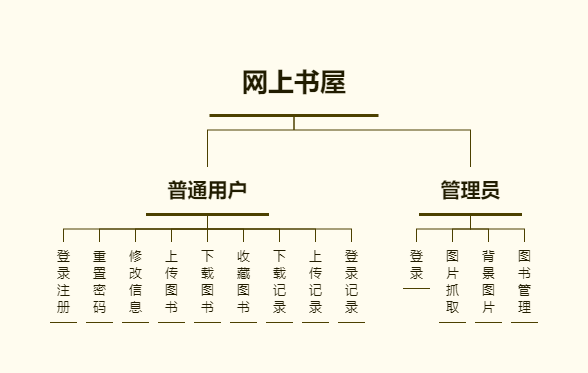
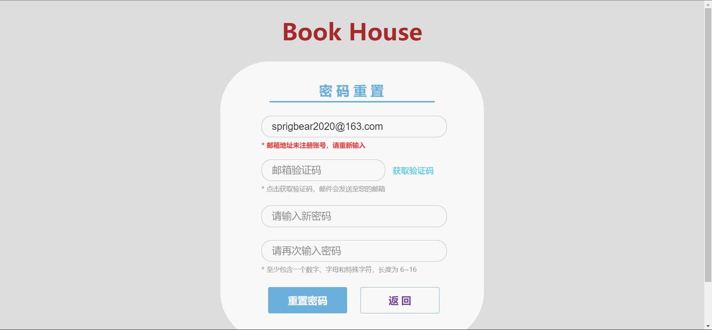
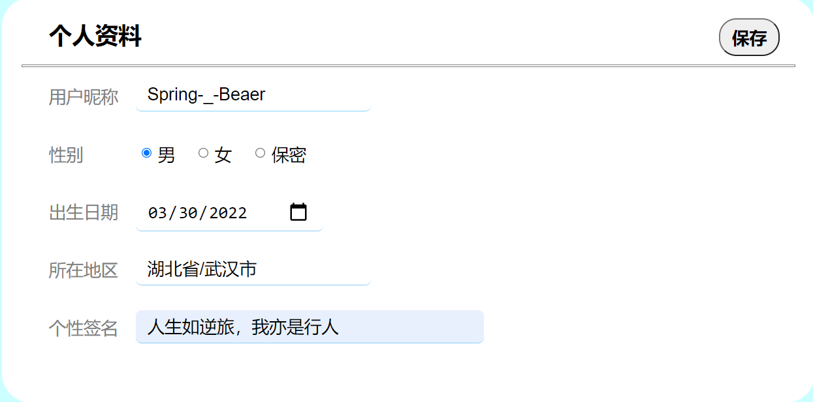
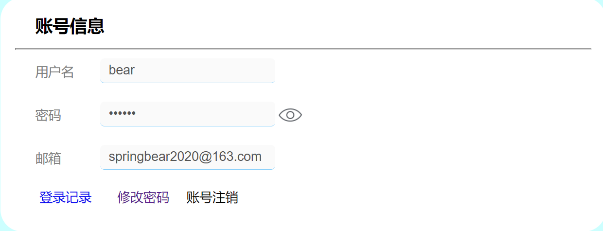
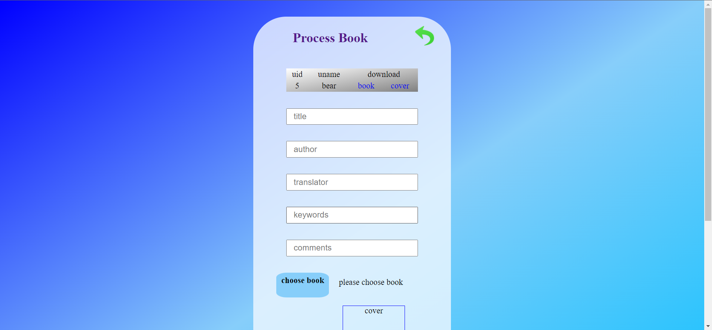

<p align="center">
    
    
    
     
    <a href="https://github.com/springbear2020/book-house-web" target="_blank">
        
    </a>
</p>

# 一、快速开始


1. 克隆仓库：使用 Git 克隆仓库或直接下载仓库压缩包到您的计算机来获取源代码。
2. 打开工程：使用 IntelliJ IDEA 开发工具打开克隆的仓库或解压的工程文件，而后使用 Maven 项目构建工具更新工程模块依赖。
3. 创建数据库并导入数据：登录 MySQL 控制台，创建一个名为 book_house_web 的数据库，并将 document/sql/ book_house_web.sql 脚本中的建表语句和数据导入到 book_house_web 数据库中。
4. 修改配置：
   - 修改 src/main/resources/jdbc.properties 文件中的数据库连接信息，设置你自己的数据库用户名和密码。
   - 修改 src/main/resources/email.properties 中的邮箱服务器信息，设置你自己的邮箱账号和服务器。
5. 部署访问：在 IntelliJ IDEA 中部署 Tomcat 并启动即可访问网上书屋首页。
6. 登录系统：系统的默认用户名和密码均为 admin。

# 二、背景调查

随着互联网技术的不断发展，网络上遍布着越来越多的有用或无用的资源，要在不计其数的资源中筛选出自己亟需的资源，需要耗费巨大的精力。尤其是各种电子图书资源（主要为 PDF）还涉及到知识产权的法律性问题，导致截至目前几乎没有哪个产品能完全满足快速检索电子图书资源和提供相关服务。

一般情况下用户所需的电子图书资源都存放在用户的个人云盘中，现有的网站系统几乎是将所有的下载链接进行糅合，杂乱无章的整合让普通用户无所适从、望而却步。对于急需查找电子图书的用户，需要到从繁杂的网页中检索出需要的图书的链接，再根据链接跳转到对应的云盘应用进行下载。不得不说，这样的方式对一般用户极其不友好，图书资源也不够规范化、有的是盗版图书、有的下载链接早已失效等，极大程度浪费了用户的精力和时间。

更甚的是，有的下载工具速度实在堪忧，还得成为会员方可提高下载速度，步骤繁多、代价太大。所以我们的 Book House 网上书屋服务系统应运而生，本着开源共享的精神，本站所有的图书资源均由用户上传，站长负责整理发布，只为用户提供一个 PDF 的 Book House（书屋）。

免责声明：本站所有 PDF 图书资源均来源于用户上传或由站长收集于网络，本站只是搜录整理他人成果。若有违规侵权，请第一时间联系站长，站长将立即清除对应图书资源，感谢！本站图书资源仅作学习交流分享使用，不作任何商用用途。

#  三、功能描述

网上书屋是一款基于 Java Web 的 PDF 图书资源服务系统，采用 JSP 和原生 Servlet 实现。它的主要功能是收集各类 PDF 图书书籍，供用户下载，并为用户提供一个完善的 PDF 书屋，让用户轻松获取所需的图书资源。



## 3.1 用户功能

1. 用户注册：用户需要使用邮箱进行注册，注册过程中需要邮箱验证码。每个用户注册成功网站默认积分为 100 分。
2. 用户登录：用户登录时可使用注册时使用的邮箱或是自定义的用户名进行登录。
3. 密码重置：用户可在登录时忘记密码，使用邮箱进行密码重置，也可在登入系统后重新设置密码。
4. 信息修改：用户可以修改自己的头像，维护个人基本信息。
5. 图书上传：用户可以上传自己收藏的 PDF 图书资源，经网站管理员审核后获取积分，上传一本图书可获得 10 积分。
6. 图书下载：用户可以在首页根据书名进行图书检索，下载自己需要的图书资源，下载一本图书减少 10 积分。
7. 图书收藏：网站首页点击图书封面可查看图书详情，可对心仪的图书进行收藏方便日后查找，也可取消收藏图书。
8. 下载记录：用户每下载一本图书对应一条图书下载记录，记录包含了下载时间、积分变换、下载图书名等信息。
9. 图书上传：用户每上传一本图书对应一条图书上传记录，记录包含了上传时间、积分变化、上传图书名等信息。

## 3.2 管理员功能

1. Pixabay 图片获取：管理员需利用爬虫技术从 Pixabay 网站获取精美图片并作为管理员登录页面的背景。
2. 管理员登录：只提供管理员登录功能，管理员身份信息直接由站长进行下发。
3. Background：管理员管理页面背景图片信息上传及维护。
4. 图书管理：管理员需对用户上传的电子图书进行管理，包括了保存新的图书记录、上传图书、下发积分给用户等操作。

# 四、数据库设计

## 4.1 数据库表

1. log_login（用户登录日志表）：日志 id、用户 id、用户名、登录 ip、登录地点、登录时间信息。
2. t_admin（管理员信息表）：管理员 id、用户名、密码、注册时间信息。
3. t_background（管理员页面背景图信息表）：图片 id、小句子、背景图磁盘保存路径、上传管理员用户名、上传时间信息。
4. t_book（图书信息表）：图书 id、书名、作者、译者、图书关键字、图书评价、下载量、收藏量、图书保存路径、封面保存路径、上传用户名、上传时间信息。
5. t_download（用户图书下载记录表）：下载记录 id、用户 id、操作（下载图书）、积分变化（-10）、下载时间、下载书名信息。
6. t_favorite（用户图书收藏记录表）：收藏记录 id、用户 id、图书 id、书名、作者、封面路径、收藏时间信息。
7. t_pixabay（管理员登录页面背景图信息表）：，包含了图书 id、检索条件、标签、浏览量、下载量、收藏量、点赞量、评论量、添加时间、大图访问地址信息。
8. t_upload（用户上传记录信息表）：上传记录 id、上传时间、用户名、操作（上传图书）、积分变化（+10）、上传时间、书名、图书保存路径、封面保存路径、收藏记录状态（管理员已处理或未处理）信息。
9. t_user（用户信息表）用户 id、用户名、密码、邮箱地址、用户积分、头像保存路径、注册时间信息。
10. t_user_info（用户基本信息表）：记录 id、用户 id、用户昵称、用户性别、用户出生年月日、用户所在地区、用户个性签名、图书收藏量、下载量、上传量、上次修改时间信息。

## 4.2 触发器

1. add_user_id_to_user_info_when_user_insert：当 t_user 表新增一条记录的时候自动将用户 id 插入到 t_user_info 表中。

   ```sql
   DELIMITER $$
   
   USE `book_house`$$
   
   DROP TRIGGER /*!50032 IF EXISTS */ `add_user_id_to_user_info_when_user_insert`$$
   
   CREATE
       /*!50017 DEFINER = 'root'@'localhost' */
       TRIGGER `add_user_id_to_user_info_when_user_insert` AFTER INSERT ON `t_user` 
       FOR EACH ROW BEGIN
       INSERT INTO t_user_info(user_id) SELECT id FROM t_user WHERE id = new.id;
   END;
   $$
   
   DELIMITER ;
   ```

2. update_user_downloads_when_user_download_insert：当 t_download 表中新增一条下载记录的时候，根据 user_id 自动将 t_user_info 表中的用户下载量增 1。

   ```sql
   DELIMITER $$
   
   USE `book_house`$$
   
   DROP TRIGGER /*!50032 IF EXISTS */ `update_user_downloads_when_user_download_insert`$$
   
   CREATE
       /*!50017 DEFINER = 'root'@'localhost' */
       TRIGGER `update_user_downloads_when_user_download_insert` AFTER INSERT ON `t_download` 
       FOR EACH ROW BEGIN
       UPDATE t_user_info SET downloads = downloads + 1 WHERE user_id = new.user_id;
   END;
   $$
   
   DELIMITER ;
   ```

3. update_user_favorites_when_favorite_delete：当 t_favorite 表中删除一条收藏记录的时候，根据 user_id 自动将 t_user_info 表中的用户收藏量减 1。

   ```sql
   DELIMITER $$
   
   USE `book_house`$$
   
   DROP TRIGGER /*!50032 IF EXISTS */ `update_user_favorites_when_favorite_delete`$$
   
   CREATE
       /*!50017 DEFINER = 'root'@'localhost' */
       TRIGGER `update_user_favorites_when_favorite_delete` AFTER DELETE ON `t_favorite` 
       FOR EACH ROW BEGIN
       UPDATE t_user_info SET collections = (SELECT COUNT(*) FROM t_favorite WHERE user_id=old.user_id );
   END;
   $$
   
   DELIMITER ;
   ```

4. update_user_favorites_when_favorite_insert：当 t_favorite 表中新增一条收藏记录的时候，根据 user_id 自动将 t_user_info 表中的用户收藏量增 1。

   ```sql
   DELIMITER $$
   
   USE `book_house`$$
   
   DROP TRIGGER /*!50032 IF EXISTS */ `update_user_favorites_when_favorite_insert`$$
   
   CREATE
       /*!50017 DEFINER = 'root'@'localhost' */
       TRIGGER `update_user_favorites_when_favorite_insert` AFTER INSERT ON `t_favorite` 
       FOR EACH ROW BEGIN
       UPDATE t_user_info SET collections = (SELECT COUNT(*) FROM t_favorite WHERE user_id=new.user_id );
   END;
   $$
   
   DELIMITER ;
   ```

5. update_user_uploads_when_user_upload_insert：当 t_upload 表中新增一条上传记录的时候，根据 user_id 自动将 t_user_info 表中的用户上传量增 1。

   ```sql
   DELIMITER $$
   
   USE `book_house`$$
   
   DROP TRIGGER /*!50032 IF EXISTS */ `update_user_uploads_when_user_upload_insert`$$
   
   CREATE
       /*!50017 DEFINER = 'root'@'localhost' */
       TRIGGER `update_user_uploads_when_user_upload_insert` AFTER INSERT ON `t_upload` 
       FOR EACH ROW BEGIN
       UPDATE t_user_info SET uploads = uploads + 1 WHERE user_id = new.user_id;
   END;
   $$
   
   DELIMITER ;
   ```

# 五、功能演示
## 5.1 用户功能
### 5.1.1 用户注册

给用户名、邮箱输入框绑定失去焦点事件，失去焦点时向服务器发起 AJAX 请求以验证用户名和邮箱的存在性，存在则友好提示用户更换用户名或邮箱。用户注册时给每个输入框绑定失去焦点事件，使用正则表达式初步验证各表单项是否符合格式要求，不符合要求则阻止表单提交。


### 5.1.2 邮箱验证码 

使用 javax.mail.jar 工具包，实现当用户点击获取按钮时向用户输入的邮箱地址发送验证码，验证码时由后台随机生成的六位长字符串，使用 AJAX 发起异步请求。使用 Google  kaptcha-2.3.2.jar 第三方工具包实现图片验证码的自动生成与刷新，当用户点击图片时刷新验证码，使用 AJAX 发起异步请求。


### 5.1.3 用户登录

用户登录时可选择用户名或邮箱进行登录，使用正则表达式验证用户名或密码不允许为空，验证通过则跳转到系统主页面，验证失败则提示用户用户名或密码错误。


### 5.1.4 重置密码

密码重置时需通过邮箱验证用户正确性，向服务器发起 AJAX 请求验证邮箱是否已注册账号，未注册则提示用户此邮箱未注册账号。通过获取验证码按钮向服务器发起 AJAX 请求，请求服务器发送随机邮箱验证码到用户输入的邮箱地址，用户新密码使用正则表达式验证格式是否符合要求。



### 5.1.5 图书上传

用户登录后可在系统主要上传入口进行电子图书资源的上传.图书上传过程中使用 JavaScript 验证图书文件格式必须为 PDF，图书封面文件格式必须为 JPG 或 PNG，不是正确的格式则不允许上传。用户图书资源上传成功后，提示用户需待管理员审核并发布图书资源后才给用户发放积分，每本图书下发 10 积分。


### 5.1.6 图书下载

用户可在图书首页或图书详情页进行图书的下载，请求服务器将对应的图书资源发送到用户计算机中。图书下载或上传成功，将在首页的小铃铛里通知用户积分变化，下载一本图书减少 10 积分，上传一本图书增加 10 积分，用户注册时默认积分为 100 积分。


### 5.1.7 图书详情

在图书首页，用户点击对应图书的封面可跳转到图书详情页，在详情页中展示了图书的更多信息，也提供了下载功能，在详情页中也可通过左右箭头图片查看下一本或上一本图书。


### 5.1.8 图书收藏

首页和图书详情页均提供用户收藏图书的功能，在图书收藏页面中展示用户收藏夹中的图书，并提供取消收藏和立即下载图书资源的功能。用户图书收藏记录唯一，即用户不可重复收藏同一本图书，若对应图书用户已收藏，则友好提示用户。

  

### 5.1.9 记录查看

用户可在首页和个人资料页查看个人历史登录记录，包含了登录 ip、登录时间、登录地点等信息（从开源数据库 [GeoIP](https://www.maxmind.com/en/geoip-demo) 获取）。用户可在首页入口查看个人图书上传和下载记录。

  

### 5.1.10 用户资料

1. 用户可点击首页的头像按钮以实现个人用户信息的维护和修改，点击退出按钮可以退出系统。在用户个人信息首页展示用户昵称、用户头像、注册时间、图书下载量、收藏量、上传量、个性签名等信息，用户也可以选择更换个人头像。

   

2. 提供用户对个人基本资料的修改，可以修改用户昵称、出生年月、所在地区、个人签名等信息。

   

3. 用户隐私信息显示，包含了用户名、密码、邮箱等信息。

   

## 5.2 管理员功能

### 5.2.1 Pixabay 网站图片获取

利用 pixabay 网站提供的 API 以及 Python 爬虫技术，定期定量从网站获取精美图片作为背景图。对获取到的 pixabay 网站图书资源进行管理时，需要管理员进行登录，未登录则提示管理员。 管理员登录时验证用户名及密码是否正确。

  

### 5.2.2 管理员页面背景图管理

1. 管理员可将心仪的图片上传作为管理员登录成功后的背景图。

   

2. 管理员可以选择上传背景图片并提交到服务器保存，以作为管理员登录的主页面。

   

### 5.2.3 用户上传图书进行管理

管理员对用户上传的图书文件进行管理，录入图书文件、上传文件到服务器、删除服务器的图书文件、下发用户积分、修改上传记录状态。



# 六、技术选型

## 6.1 第三方工具库

| 第三发 jar 包                   | 功能                             |
| :------------------------------ | :------------------------------- |
| commons-beanutils-1.8.0.jar     | 表单请求参数转换为 JavaBean 对象 |
| commons-logging-1.1.1.jar       | 表单请求参数转换为 JavaBean 对象 |
| commons-fileupload-1.2.1.jar    | 文件上传、下载服务               |
| commons-io-1.4.jar              | 文件上传、下载服务               |
| junit-4.12.jar                  | 单元测试                         |
| hamcrest-core-1.3.jar           | 单元测试                         |
| taglibs-standard-impl-1.2.1.jar | JSTL 标签库                      |
| taglibs-standard-spec-1.2.1.jar | JSTL 标签库                      |
| geoip2-2.15.0.jar               | MAXMIND IP 开源数据库，解析 IP   |
| maxmind-db-2.0.0.jar            | MAXMIND IP 开源数据库，解析 IP   |
| mysql-connector-java-8.0.27.jar | MySQL Jdbc 驱动链接              |
| commons-dbutils-1.3.jar         | 数据库操作工具类                 |
| javax.mail.jar                  | 邮件发送服务                     |
| kaptcha-2.3.2.jar               | 图片验证码生成服务               |
| druid-1.1.10.jar                | 德鲁伊数据库连接池               |

## 6.2 技术环境说明

| 技术/环境             | 说明                       |
| :-------------------- | :------------------------- |
| HTML、CSS、JavaScript | 前端三件套                 |
| jQuery                | DOM 操作 JS 框架           |
| AJAX                  | 异步通信技术，局部刷新页面 |
| Tomcat                | Web 服务器                 |
| Git                   | 版本控制工具               |
| Maven                 | 项目构建工具               |
| MySQL                 | 关系型数据库               |
| IDEA                  | 集成开发环境               |
| JSP                   | 动态网页生成技术           |
| JSTL标签库            | 简化和加强JSP开发的标签库  |
| EL表达式              | 访问和操作 JSP 页面数据    |

# 七、工程结构

```lua
DMS
├── document      -- 资源文档，如图片、SQL 脚本等
├── src           -- 源代码  
	├── main
		├── java
			├── dao			-- 持久化操作类
			├── pojo		-- 实体类
			├── service		-- 业务服务类
			├── util		-- 通用工具类
			├── web			-- Servlet 请求类
		├── resources			-- 配置文件
		├── webapp
			├── static		-- 静态资源，如 js、css
			├── WEB-INF		-- 受服务器保护的目录，包含页面、jar 包和 web.xml 等
			├── index.jsp		-- 首页
	├── test
```

# 八、许可证

```
MIT License

Copyright (c) 2023 Spring-_-Bear

Permission is hereby granted, free of charge, to any person obtaining a copy
of this software and associated documentation files (the "Software"), to deal
in the Software without restriction, including without limitation the rights
to use, copy, modify, merge, publish, distribute, sublicense, and/or sell
copies of the Software, and to permit persons to whom the Software is
furnished to do so, subject to the following conditions:

The above copyright notice and this permission notice shall be included in all
copies or substantial portions of the Software.

THE SOFTWARE IS PROVIDED "AS IS", WITHOUT WARRANTY OF ANY KIND, EXPRESS OR
IMPLIED, INCLUDING BUT NOT LIMITED TO THE WARRANTIES OF MERCHANTABILITY,
FITNESS FOR A PARTICULAR PURPOSE AND NONINFRINGEMENT. IN NO EVENT SHALL THE
AUTHORS OR COPYRIGHT HOLDERS BE LIABLE FOR ANY CLAIM, DAMAGES OR OTHER
LIABILITY, WHETHER IN AN ACTION OF CONTRACT, TORT OR OTHERWISE, ARISING FROM,
OUT OF OR IN CONNECTION WITH THE SOFTWARE OR THE USE OR OTHER DEALINGS IN THE
SOFTWARE.
```

