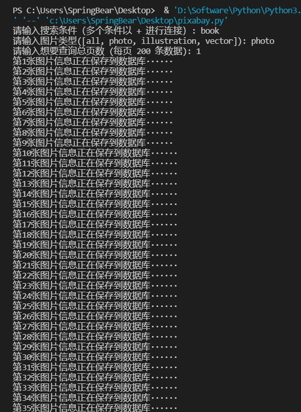
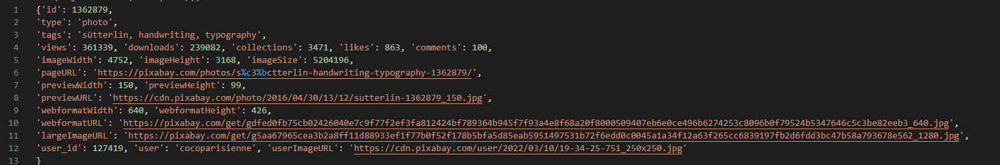
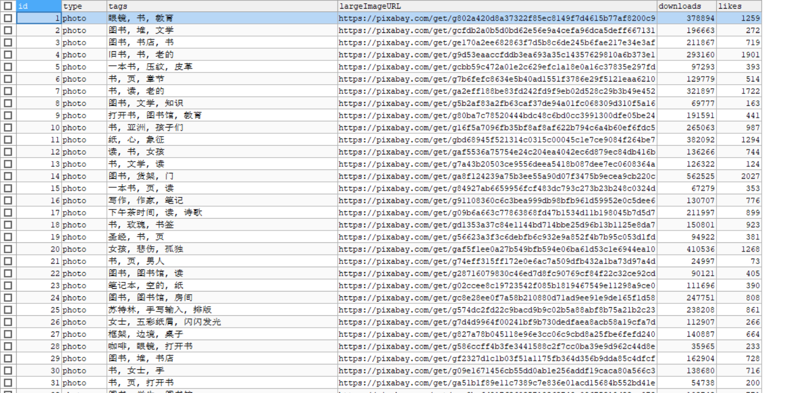

> [Pixabay.com](https://pixabay.com/) is a free stock photography and royalty-free stock media website. It is used for sharing photos, illustrations, vector graphics, film footage, and music, exclusively under the custom Pixabay license, which generally allows the free use of the material with some restrictions.

Pixabay 是一个免费的图像摄影、免版权的媒体网站。 它用于共享照片、插图、矢量图形、电影镜头和音乐。在 Pixabay 官方的许可下，一定限制范围内通常可以免费使用网站上的资源。

# 一、版本一

## 1.1 SQL 脚本

```sql
CREATE DATABASE pixabay;

USE pixabay;

CREATE TABLE t_picture(
`id` INT NOT NULL AUTO_INCREMENT PRIMARY KEY, /* id */
`type` VARCHAR(32),			      /* 类型 */
`tags` VARCHAR(32),                           /* 标签 */
`largeImageURL` VARCHAR(512),		      /* 图片访问地址 */
`downloads` INT,			      /* 下载量 */
`likes` INT                                   /* 喜欢的人数 */
);
```
## 1.2 Python 代码

```python
import requests
import json
import pymysql

'''
需要修改的地方：
    1. 第 13 行填入自己在 Pixabay 官方获得的 key 信息
    2. 第 30 行填入自己的浏览器 User-Agent 信息
    3. 第 38 行填入自己的 MySQL IP、用户名、密码、端口号、数据库名、编码 信息
    4. 第 50 行修改为自己创建表的字段信息（如与我的数据库表保持一致则无需修改）
'''

# 发起请求，并将网站响应解析为 json 对象
def get_json(page, condition, image_type):
    # key 的值为 Pixabay 官方给你的 key 值，在 API 页面可查询到
    key = 'your_key'
    url = 'https://pixabay.com/api/'
    # 你需要从 Pixabay 网站获取的图片的参数信息，更多键可查看官方 API
    pa = {
        'key': key,
        'q': condition,
        'image_type': image_type,
        'lang': 'zh',
        'page': page,
        'per_page': 200,
    }
    # 发起请求，从 Pixabay网站获取信息并将请求相应内容解析为 json 对象
    request = requests.get(url, params=pa, headers=headers)
    decode_json = json.loads(request.text)
    return decode_json

# headers 为你自己浏览器的 User-Agent 信息，如何查看可自行百度
headers = { 'User-Agent': 'your_user_agent'}
condition = input("请输入搜索条件（多个条件以 + 进行连接）: ")
image_type = input("请输入图片类型([all, photo, illustration, vector]): ")
number = input('请输入想要查询总页数 (每页 200 条数据): ')

# 链接到 MySQL 数据库并获得一个 MySQL 连接对象（需要填入你自己的 MySQL 信息）
db = pymysql.connect(host='localhost', user="your_useranme",passwd="your_password", port=3306, db='pixabay', charset='utf8')
cursor = db.cursor()

count = 0
for page in range(0, int(number)):
    # 设定需要多少页数据，就发起多少次请求
    decode_json = get_json(page + 1, condition, image_type)
    # 依次解析 json 对象列表，获得一个图片对象
    for picture in decode_json['hits']:
        count += 1
        print("第" + str(count) +"张图片信息正在保存到数据库······")
        # 执行 sql 语句将本张图片信息保存到数据库
        sql = """INSERT INTO t_picture (`type`, `tags`, `largeImageURL`, `downloads`, `likes`)VALUES(%s, %s, %s, %s, %s);"""
        cursor.execute(sql, (picture['type'], picture['tags'], picture['largeImageURL'], picture['downloads'],picture['likes']))
        db.commit()

# 关闭数据连接
cursor.close()
db.close()
```
## 1.3 运行示例



## 1.4 响应参数



## 1.5 结果展示




# 二、版本二

## 2.1 SQL 脚本

```sql
CREATE TABLE `t_pixabay` (
  `id` int NOT NULL AUTO_INCREMENT,
  `type` varchar(16) DEFAULT NULL,
  `tags` varchar(64) DEFAULT NULL,
  `views` int DEFAULT NULL,
  `downloads` int DEFAULT NULL,
  `collections` int DEFAULT NULL,
  `likes` int DEFAULT NULL,
  `comments` int DEFAULT NULL,
  `add_time` date DEFAULT NULL,
  `page_url` varchar(512) DEFAULT NULL,
  `image_width` int DEFAULT NULL,
  `image_height` int DEFAULT NULL,
  `image_size` int DEFAULT NULL,
  `large_image_url` varchar(512) DEFAULT NULL,
  `preview_width` int DEFAULT NULL,
  `preview_height` int DEFAULT NULL,
  `preview_url` varchar(512) DEFAULT NULL,
  `web_format_width` int DEFAULT NULL,
  `web_format_height` int DEFAULT NULL,
  `web_format_url` varchar(512) CHARACTER SET utf8mb4 COLLATE utf8mb4_0900_ai_ci DEFAULT NULL,
  `user_id` int DEFAULT NULL,
  `user` varchar(64) DEFAULT NULL,
  `user_image_url` varchar(512) DEFAULT NULL,
  PRIMARY KEY (`id`)
) ENGINE=InnoDB DEFAULT CHARSET=utf8mb4 COLLATE=utf8mb4_0900_ai_ci;
```

## 2.2 Python 代码

```python
from datetime import date
from unicodedata import category
import requests
import json
import pymysql

# 输入并设置请求的图片参数
condition = input("condition:")
page = input('page(20 pictures per page):')
req_params = {
    'key': '',
    'q': condition,
    'lang': 'en',
    'orientation': 'horizontal',
    'page': -1,
}

# 设置数据库信息
db = pymysql.connect(host='', user="", passwd="", port=3306, db='', charset='utf8')
cursor = db.cursor()

resCount = 0
saveCount = 0
for i in range(0, int(page)):
    # 请求 Pixabay 第 page 页的图片数据并解析为 json 对象
    req_params['page'] = i + 1
    request = requests.get('https://pixabay.com/api/', params=req_params, headers={'User-Agent': 'Mozilla/5.0 (Windows NT 10.0; Win64; x64) AppleWebKit/537.36 (KHTML, like Gecko) Chrome/98.0.4758.102 Safari/537.36'})
    decode_json = json.loads(request.text)

    # 依次解析当前页的每张图片信息并保存到数据库
    for picture in decode_json['hits']:
        resCount += 1
        print(str(resCount) + ": " + picture['largeImageURL'])
        # choice = input("Save this picture or not[y/n]:")
        # if(choice != 'y'):
        #     continue
        saveCount += 1
        print("The " + str(saveCount) + " pictures is saving to the database······")
        sql = """INSERT INTO t_pixabay(`type`,`tags`,`views`,`downloads`,`collections`,`likes`,`comments`,`add_time`,`page_url`,`image_width`,`image_height`,`image_size`,`large_image_url`,`preview_width`,`preview_height`,`preview_url`,`web_format_width`,`web_format_height`,`web_format_url`,`user_id`,`user`,`user_image_url`) VALUES (%s,%s,%s,%s,%s,%s,%s,%s,%s,%s,%s,%s,%s,%s,%s,%s,%s,%s,%s,%s,%s,%s);"""
        cursor.execute(sql, (picture['type'], picture['tags'], picture['views'],picture['downloads'], picture['collections'], picture['likes'], picture['comments'], date.today(), picture['pageURL'], picture['imageWidth'], picture['imageHeight'], picture['imageSize'], picture['largeImageURL'], picture['previewWidth'], picture['previewHeight'], picture['previewURL'], picture['webformatWidth'], picture['webformatHeight'], picture['webformatURL'], picture['user_id'], picture['user'], picture['userImageURL']))
        db.commit()
cursor.close()
db.close()
```
## 2.3 POJO 类

```java
package com.bear.bookhouse.pojo;

import java.util.Date;

/**
 * @author Spring-_-Bear
 * @datetime 2022/3/18 19:03
 */
public class Picture {
    private Integer id;
    private Integer views;
    private Integer downloads;
    private Integer collections;
    private Integer likes;
    private Integer comments;
    private String tags;
    private Integer width;
    private Integer height;
    private Integer size;
    private String url;
    private Date addTime;

    public Picture() {
    }

    public Picture(Integer id, Integer views, Integer downloads, Integer collections, Integer likes, Integer comments, String tags, Integer width, Integer height, Integer size, String url, Date addTime) {
        this.id = id;
        this.views = views;
        this.downloads = downloads;
        this.collections = collections;
        this.likes = likes;
        this.comments = comments;
        this.tags = tags;
        this.width = width;
        this.height = height;
        this.size = size;
        this.url = url;
        this.addTime = addTime;
    }

    public Integer getId() {
        return id;
    }

    public void setId(Integer id) {
        this.id = id;
    }

    public Integer getViews() {
        return views;
    }

    public void setViews(Integer views) {
        this.views = views;
    }

    public Integer getDownloads() {
        return downloads;
    }

    public void setDownloads(Integer downloads) {
        this.downloads = downloads;
    }

    public Integer getCollections() {
        return collections;
    }

    public void setCollections(Integer collections) {
        this.collections = collections;
    }

    public Integer getLikes() {
        return likes;
    }

    public void setLikes(Integer likes) {
        this.likes = likes;
    }

    public Integer getComments() {
        return comments;
    }

    public void setComments(Integer comments) {
        this.comments = comments;
    }

    public String getTags() {
        return tags;
    }

    public void setTags(String tags) {
        this.tags = tags;
    }

    public Integer getWidth() {
        return width;
    }

    public void setWidth(Integer width) {
        this.width = width;
    }

    public Integer getHeight() {
        return height;
    }

    public void setHeight(Integer height) {
        this.height = height;
    }

    public Integer getSize() {
        return size;
    }

    public void setSize(Integer size) {
        this.size = size;
    }

    public String getUrl() {
        return url;
    }

    public void setUrl(String url) {
        this.url = url;
    }

    public Date getAddTime() {
        return addTime;
    }

    public void setAddTime(Date addTime) {
        this.addTime = addTime;
    }

    @Override
    public String toString() {
        return "Picture{" +
                "id=" + id +
                ", views=" + views +
                ", downloads=" + downloads +
                ", collections=" + collections +
                ", likes=" + likes +
                ", comments=" + comments +
                ", tags='" + tags + '\'' +
                ", width=" + width +
                ", height=" + height +
                ", size=" + size +
                ", url='" + url + '\'' +
                ", addTime=" + addTime +
                '}';
    }
}
```

## 2.4 DAO 类

```java
package com.bear.bookhouse.dao.impl;

import com.bear.bookhouse.dao.BaseDao;
import com.bear.bookhouse.dao.PictureDao;
import com.bear.bookhouse.pojo.Picture;


/**
 * @author Spring-_-Bear
 * @datetime 2022/3/18 19:11
 */
public class PictureDaoImpl extends BaseDao implements PictureDao {
    @Override
    public Picture getPictureById(int id) {
        String sql = "SELECT `id`,`views`,`downloads`,`collections`,`likes`,`comments`,`tags`,`image_width` width,`image_height` height,`image_size` size,`large_image_url` url, `add_time` addTime FROM `t_pixabay` WHERE id = ?;";
        Object[] params = new Object[]{id};
        return getRecord(Picture.class, sql, params);
    }

    @Override
    public Long getAllPicturesCount() {
        String sql = "SELECT COUNT(`id`) FROM `t_pixabay`;";
        return (Long) getSingleValue(sql);
    }
}
```

# 三、版本三

## 3.1 SQL 脚本

```sql
CREATE TABLE `t_pixabay` (
  `id` int NOT NULL AUTO_INCREMENT COMMENT '图片 id',
  `condition` varchar(64) CHARACTER SET utf8mb4 COLLATE utf8mb4_0900_ai_ci DEFAULT NULL COMMENT '检索条件',
  `tags` varchar(64) CHARACTER SET utf8mb4 COLLATE utf8mb4_0900_ai_ci DEFAULT NULL COMMENT '标签',
  `views` int DEFAULT NULL COMMENT '浏览量',
  `downloads` int DEFAULT NULL COMMENT '下载量',
  `collections` int DEFAULT NULL COMMENT '收藏量',
  `likes` int DEFAULT NULL COMMENT '点赞量',
  `comments` int DEFAULT NULL COMMENT '评论量',
  `add_time` date DEFAULT NULL COMMENT '添加时间',
  `large_image_url` varchar(512) CHARACTER SET utf8mb4 COLLATE utf8mb4_0900_ai_ci DEFAULT NULL COMMENT '图片访问地址',
  PRIMARY KEY (`id`)
) ENGINE=InnoDB AUTO_INCREMENT=1001 DEFAULT CHARSET=utf8mb4 COLLATE=utf8mb4_0900_ai_ci;
```

## 3.2 Python 代码

```python
from datetime import date
from unicodedata import category
import requests
import json
import pymysql

# 输入并设置请求的图片参数
condition = input("condition:")
page = input('page(20 pictures per page):')
req_params = {
    'key': '',
    'q': condition,
    'lang': 'en',
    'orientation': 'horizontal',
    'page': -1,
}

# 设置数据库信息
db = pymysql.connect(host='', user="", passwd="", port=3306, db='book_house', charset='utf8')
cursor = db.cursor()

saveCount = 0
for i in range(0, int(page)):
    # 请求 Pixabay 第 page 页的图片数据并解析为 json 对象
    req_params['page'] = i + 1
    request = requests.get('https://pixabay.com/api/', params=req_params, headers={'User-Agent': 'Mozilla/5.0 (Windows NT 10.0; Win64; x64) AppleWebKit/537.36 (KHTML, like Gecko) Chrome/98.0.4758.102 Safari/537.36'})
    decode_json = json.loads(request.text)

    # 依次解析当前页的每张图片信息并保存到数据库
    for picture in decode_json['hits']:
        saveCount = saveCount + 1
        print("The " + str(saveCount) + " pictures is saving to the database······")
        sql = """INSERT INTO `t_pixabay`(`condition`,`tags`,`views`,`downloads`,`collections`,`likes`,`comments`,`add_time`,`large_image_url`) VALUES (%s,%s,%s,%s,%s,%s,%s,%s,%s);"""
        cursor.execute(sql, (condition, picture['tags'], picture['views'],picture['downloads'], picture['collections'], picture['likes'], picture['comments'],  date.today(),picture['largeImageURL']))
        db.commit()
cursor.close()
db.close()
```

## 3.3 POJO 类

```java
package com.bear.bookhouse.pojo;

import java.util.Date;

/**
 * @author Spring-_-Bear
 * @datetime 2022/3/26 23:16
 */
public class Pixabay {
    private Integer id;
    private String condition;
    private String tags;
    private Integer views;
    private Integer downloads;
    private Integer collections;
    private Integer likes;
    private Integer comments;
    private Date addTime;
    private String url;

    public static final int ERROR = -1;
    public static final String DELETE_ONE = "one";
    public static final String DELETE_ALL = "all";

    public Pixabay() {
    }

    public Pixabay(Integer id, String condition, String tags, Integer views, Integer downloads, Integer collections, Integer likes, Integer comments, Date addTime, String url) {
        this.id = id;
        this.condition = condition;
        this.tags = tags;
        this.views = views;
        this.downloads = downloads;
        this.collections = collections;
        this.likes = likes;
        this.comments = comments;
        this.addTime = addTime;
        this.url = url;
    }

    public Integer getId() {
        return id;
    }

    public void setId(Integer id) {
        this.id = id;
    }

    public String getCondition() {
        return condition;
    }

    public void setCondition(String condition) {
        this.condition = condition;
    }

    public String getTags() {
        return tags;
    }

    public void setTags(String tags) {
        this.tags = tags;
    }

    public Integer getViews() {
        return views;
    }

    public void setViews(Integer views) {
        this.views = views;
    }

    public Integer getDownloads() {
        return downloads;
    }

    public void setDownloads(Integer downloads) {
        this.downloads = downloads;
    }

    public Integer getCollections() {
        return collections;
    }

    public void setCollections(Integer collections) {
        this.collections = collections;
    }

    public Integer getLikes() {
        return likes;
    }

    public void setLikes(Integer likes) {
        this.likes = likes;
    }

    public Integer getComments() {
        return comments;
    }

    public void setComments(Integer comments) {
        this.comments = comments;
    }

    public Date getAddTime() {
        return addTime;
    }

    public void setAddTime(Date addTime) {
        this.addTime = addTime;
    }

    public String getUrl() {
        return url;
    }

    public void setUrl(String url) {
        this.url = url;
    }

    @Override
    public String toString() {
        return "Pixabay{" +
                "id=" + id +
                ", condition='" + condition + '\'' +
                ", tags='" + tags + '\'' +
                ", views=" + views +
                ", downloads=" + downloads +
                ", collections=" + collections +
                ", likes=" + likes +
                ", comments=" + comments +
                ", addTime=" + addTime +
                ", url='" + url + '\'' +
                '}';
    }
}
```

## 3.4 DAO 类

```java
package com.bear.bookhouse.dao;

import com.bear.bookhouse.pojo.Pixabay;

/**
 * @author Spring-_-Bear
 * @datetime 2022/3/26 23:18
 */
public interface PixabayDao {
    /**
     * 通过 id 获取图片
     *
     * @param id id
     * @return Pixabay
     */
    Pixabay getPixabayById(int id);

    /**
     * 获取图片总记录数
     *
     * @return 总记录数
     */
    int getPixabayCounts();

    /**
     * 通过 id 删除图片
     *
     * @param id id
     * @return 1 - 删除成功
     */
    int deletePixabayById(int id);

    /**
     * 删除所有 pixabay 图片
     *
     * @return 1 - 删除成功
     */
    int deleteAllPixabay();

    /**
     * 重置自增 id 为 1
     *
     * @return 1 - 重置成功
     */
    int resetIncrement();
}
```


